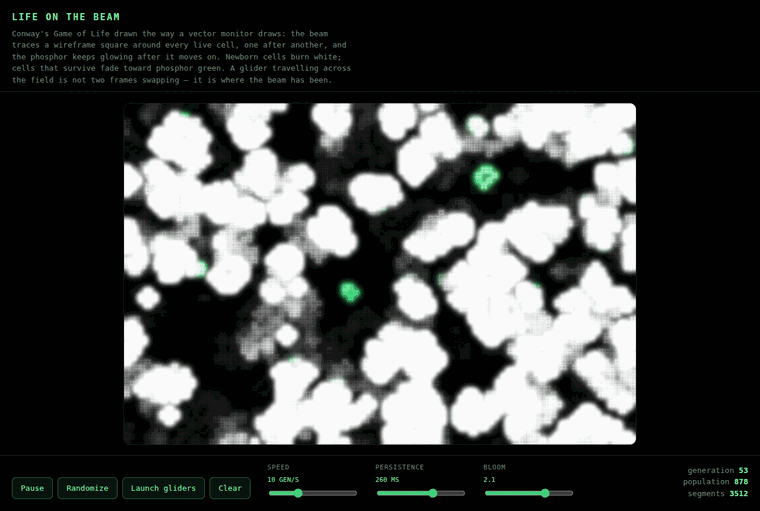

# vector-display

Fast, general-purpose rendering of vector-arcade-style graphics (think *Asteroids*, *Tempest*, *Star Wars*) for the browser, with optional phosphor, bloom and flicker effects.

> **Status:** published. All five packages are on npm at `0.1.0` — install them from
> the registry and they resolve today. The APIs are still settling (0.x), so pin a
> version you have tested. See [docs/ARCHITECTURE.md](docs/ARCHITECTURE.md) for the
> design, measurements and roadmap.

## Life on the Beam

Conway's Game of Life, drawn the way a vector monitor draws it. A CRT has no frame
buffer: the beam has to *draw* every lit cell, one after another, and the phosphor
keeps glowing after the beam moves on. So each generation is traced as a wireframe
square per live cell, newborn cells burn white, survivors fade toward phosphor
green, and a glider crossing the field is not two frames swapping — it is where the
beam has been.



| | |
| --- | --- |
| **[Life on the Beam](examples/demo/docs/life-on-the-beam.mp4)** | Dense field, 897 live cells, 3,588 beam segments, high persistence |
| **[Gliders crossing the wrapped grid](examples/demo/docs/life-gliders.gif)** | Six gliders travelling forever on a torus — 30 cells, 120 segments |

The grid wraps, so patterns that leave one edge return on the opposite edge and the
display never dies against a wall. Drag on the canvas to paint live cells, or run
`npm run dev` and open `/life.html`.

## Packages

| Package | What it does | Install |
| --- | --- | --- |
| [`@vector-display/core`](packages/core) | Shapes and per-frame display lists of beam segments. No rendering; runs anywhere | `npm i @vector-display/core` |
| [`@vector-display/webgl`](packages/webgl) | WebGL2 renderer: the whole display list in one draw call, with glow and bright endpoints | `npm i @vector-display/webgl` |
| [`@vector-display/beam-fx`](packages/beam-fx) | Phosphor persistence, bloom and flicker on top of the WebGL renderer | `npm i @vector-display/beam-fx` |
| [`@vector-display/font`](packages/font) | Atari-style vector stroke font with text layout | `npm i @vector-display/font` |
| [`@vector-display/3d`](packages/3d) | Wireframe models and perspective projection built on es-vector-math | `npm i @vector-display/3d` |
| [`examples/demo`](examples/demo) | Renderer benchmark (p5.js vs WebGL2 vs WebGL2 with phosphor), a font & 3D showcase, and **Life on the Beam** | — |

A working game built on these: [vector-asteroids](https://github.com/rsegrest/vector-asteroids).

## Usage

```ts
import { DisplayList, Shape } from "@vector-display/core";
import { WebGLVectorRenderer } from "@vector-display/webgl";
import { PhosphorPipeline } from "@vector-display/beam-fx";

const ship = Shape.fromPolyline({
  points: [{ x: 0, y: -10 }, { x: -7.5, y: 10 }, { x: -5, y: 5 }, { x: 5, y: 5 }, { x: 7.5, y: 10 }],
  isClosed: true,
});

const renderer = WebGLVectorRenderer.fromCanvas(canvas, { width: 1024, height: 768 });
const phosphor = new PhosphorPipeline(renderer, { persistenceHalfLifeMilliseconds: 40 });
const displayList = new DisplayList();

function drawFrame(elapsedMilliseconds: number) {
  displayList.clear();
  displayList.setColor({ red: 0.85, green: 0.95, blue: 1 });
  displayList.addShape(ship, { x: 512, y: 384, rotation: 0, scale: 2, intensity: 1 });
  phosphor.renderFrame(displayList, elapsedMilliseconds);
  // Without effects: renderer.clear(); renderer.drawDisplayList(displayList);
}
```

To soften or remove the bright dots at vertices, lower `endpointBrightness` and `jointOverlap`:

```ts
renderer.setLineStyle({ endpointBrightness: 0, jointOverlap: 0 }); // seamless joints, no vertex highlight
```

### Text and 3D

```ts
import { SCREEN_SPACE_PLACEMENT } from "@vector-display/core";
import { VectorFont } from "@vector-display/font";
import { DEFAULT_PERSPECTIVE_CAMERA, WireframeProjector, createBoxModel, createModelPlacement } from "@vector-display/3d";
import { Angle, Vector } from "es-vector-math";

const font = VectorFont.createArcadeFont();
font.addText(displayList, { text: "SCORE 01250", x: 40, y: 30, size: 20 });

const cube = createBoxModel({ width: 100, height: 100, depth: 100 });
const projector = new WireframeProjector(DEFAULT_PERSPECTIVE_CAMERA);
const placement = createModelPlacement({ position: new Vector(0, 0, 300), rotationY: Angle.fromDegrees(30) });
displayList.addShape(projector.project(cube, placement), SCREEN_SPACE_PLACEMENT);
```

World coordinates use a top-left origin with y pointing down, like Canvas 2D and p5. Points only need `x` and `y`, so es-vector-math `Vector` and `Point` instances work directly.

## Development

Requires Node 24+.

```sh
npm install
npm run dev        # demo app (Vite): benchmark at /, font & 3D at /font-and-3d.html, Life at /life.html
npm test           # unit tests (Vitest)
npm run build      # build all packages (tsc -b)
npm run typecheck  # packages + demo
```

## License

[MIT](LICENSE) © Rick Segrest
